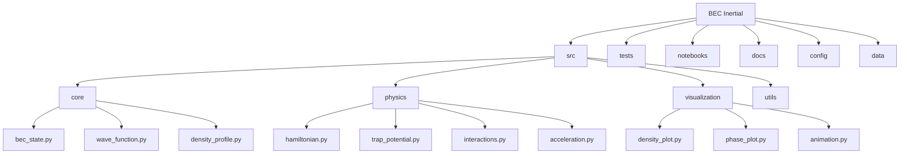
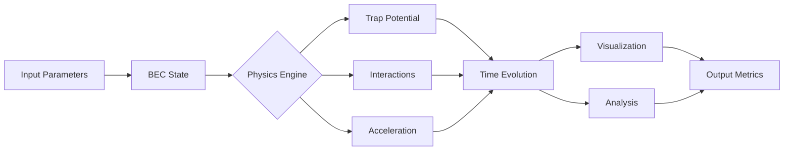
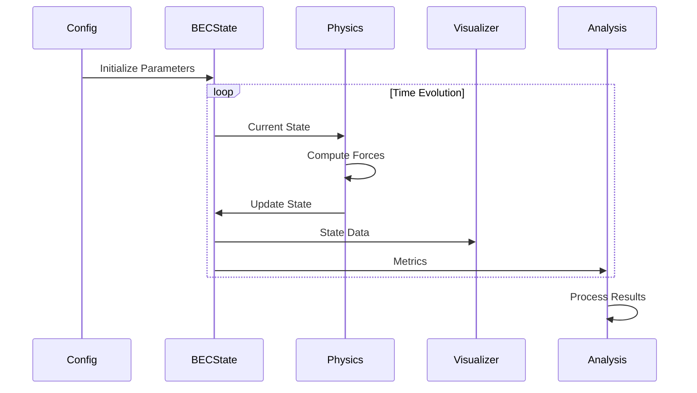

# BEC Inertial Sensor Simulation
A Python-based simulation framework for modeling Bose-Einstein Condensate (BEC) based inertial sensors, with applications in inertial navigation systems in high-precision vehicles.

## Overview
This project implements numerical simulations of BEC dynamics under acceleration, solving the time-dependent Gross-Pitaevskii equation with external potentials. The system models how a trapped BEC responds to inertial forces, providing high-precision acceleration measurements.

## Project Structure



## System Architecture



## Data Flow



## Installation

```bash
# Clone the repository
git clone https://github.com/yourusername/bec_inertial.git
cd bec_inertial

# Create a virtual environment
python -m venv venv
source venv/bin/activate  # On Windows: venv\Scripts\activate

# Install dependencies
pip install -r requirements.txt
```

## Usage

Basic usage example:

```python
from src.core.bec_state import BECState
from src.physics.acceleration import AccelerationSensor

# Initialize BEC state
bec = BECState(atoms=1e5, trap_frequency=100.0)

# Create sensor
sensor = AccelerationSensor(bec)

# Run simulation
results = sensor.simulate(duration=1.0, dt=0.001)
```

## Features

1. **Core Simulation**
   - Time-dependent Gross-Pitaevskii equation solver
   - Adaptive step size integration
   - Conservation law monitoring

2. **Physics Modules**
   - Harmonic trap potential
   - Mean-field interactions
   - External acceleration forces
   - Quantum pressure terms

3. **Analysis Tools**
   - Phase space analysis
   - Density profile extraction
   - Response function calculation
   - Sensitivity metrics

4. **Visualization**
   - Real-time density plots
   - Phase evolution
   - Animation capabilities
   - Metric tracking

## Configuration

Simulation parameters are stored in `config/simulation_params.yaml`. Example configuration:

```yaml
simulation:
  atoms: 1e5
  trap_frequency: 100.0
  interaction_strength: 1.0
  grid_points: 256
  box_size: 20.0
  
physics:
  acceleration_range: [-10.0, 10.0]
  measurement_time: 1.0
  temperature: 1e-9
```

## Development

To contribute to the project:

1. Fork the repository
2. Create a feature branch (`git checkout -b feature/AmazingFeature`)
3. Commit your changes (`git commit -m 'Add some AmazingFeature'`)
4. Push to the branch (`git push origin feature/AmazingFeature`)
5. Open a Pull Request

## Testing

Run the test suite:

```bash
pytest tests/
```

## License

Distributed under the MIT License. See `LICENSE` for more information.

## Contact

Your Name - your.email@example.com
Project Link: https://github.com/yourusername/bec_inertial

## Acknowledgments

- References to key BEC papers and theoretical frameworks
- Credits to numerical methods used
- Any other acknowledgments

## References

1. Key paper on BEC-based inertial sensing
2. Gross-Pitaevskii equation numerical methods
3. Relevant experimental implementations