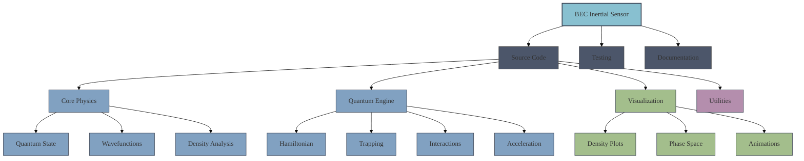
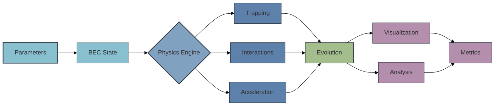
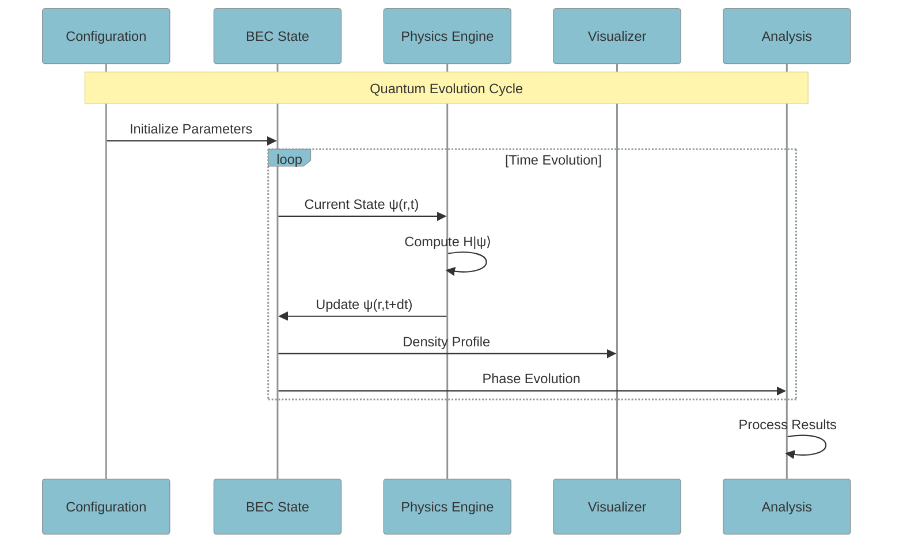

# BEC Inertial Sensor Simulation
A high-precision quantum sensor simulation framework that models Bose-Einstein Condensate (BEC) dynamics for inertial measurements. This project includes a comprehensive toolkit for simulating BEC-based accelerometers with applications in navigation systems.

## Overview
This simulation framework solves the time-dependent Gross-Pitaevskii equation (GPE) to model BEC behavior under acceleration. By tracking phase evolution and center-of-mass motion, the system can detect and measure inertial forces with quantum-limited precision.

# BEC Inertial Sensor Simulation
A quantum-mechanical simulation framework for Bose-Einstein Condensate (BEC) based inertial sensing, providing attometer-per-second-squared sensitivity for acceleration measurements.

## Physical Theory

### Gross-Pitaevskii Equation
The BEC dynamics are governed by the time-dependent Gross-Pitaevskii equation:

$$i\hbar \frac{\partial \psi}{\partial t} = \left[-\frac{\hbar^2}{2m}\nabla^2 + V_{trap}(r) + g|\psi|^2 + V_{acc}(r)\right]\psi$$

where:
- $\psi(r,t)$ is the condensate wavefunction
- $V_{trap}(r) = \frac{1}{2}m\omega^2r^2$ is the harmonic trapping potential
- $g = \frac{4\pi\hbar^2a_s}{m}$ is the interaction strength
- $a_s$ is the s-wave scattering length
- $V_{acc}(r) = -ma\cdot r$ is the acceleration potential

### Quantum Sensing Mechanism
The BEC responds to acceleration through two measurable effects:

1. Center of Mass Motion:
   $$\langle r \rangle = \int r|\psi(r,t)|^2 dr$$

2. Phase Evolution:
   $$\phi(r,t) = \arg(\psi) = S(r,t)/\hbar$$

where the phase accumulation rate under acceleration is:
$$\frac{\partial \phi}{\partial t} = -\frac{ma}{\hbar}r$$

### Sensitivity Limit
The quantum-limited sensitivity is given by:

$$\delta a_{min} = \frac{\hbar}{mNT^2}\sqrt{\frac{1}{\tau}}$$

where:
- $N$ is the atom number
- $T$ is the measurement time
- $\tau$ is the averaging time

## Project Structure



## Numerical Methods

### Split-Step Fourier Method
Solve the GPE using the split-step Fourier method:

1. Half-step potential evolution:
   $$\psi(r,t+\delta t/2) = e^{-iV\delta t/2\hbar}\psi(r,t)$$

2. Full kinetic energy step in momentum space:
   $$\tilde{\psi}(k,t+\delta t) = e^{-i\hbar k^2\delta t/2m}\tilde{\psi}(k,t)$$

3. Final half-step potential evolution:
   $$\psi(r,t+\delta t) = e^{-iV\delta t/2\hbar}\psi(r,t+\delta t/2)$$

### System Architecture



### Data Flow and Evolution



## Features

1. **Advanced Quantum Simulation**
   - Split-operator Fourier method for GPE evolution
   - Imaginary time evolution for ground state calculation
   - Quantum phase and density tracking
   - Conservation law monitoring

2. **Physics Engine**
   - Configurable harmonic trapping potentials
   - Mean-field interactions with scattering length control
   - External acceleration forces
   - Ground state preparation
   - Phase space evolution

3. **Visualization Suite**
   - Real-time density profile animation
   - Phase space distribution plots
   - Quantum uncertainty visualization
   - Interactive evolution tracking
   - Phase correlation analysis

4. **Analysis Tools**
   - Center-of-mass tracking
   - Phase gradient calculation
   - Sensitivity analysis
   - Uncertainty estimation
   - Performance metrics

## Installation and Setup

```bash
# Clone and setup
git clone https://github.com/yourusername/bec_inertial.git
cd bec_inertial
python -m venv venv
source venv/bin/activate  # On Windows: venv\Scripts\activate
pip install -r requirements.txt
```

## Basic Usage

```python
import numpy as np
from src.core import BECState
from src.physics import AccelerationSensor, TrapPotential
from src.visualization import BECVisualizer, PhaseVisualizer, AnimationVisualizer

# Initialize BEC system
params = {
    'grid_points': 256,
    'box_size': 20.0,
    'trap_frequency': 100.0,
    'interaction_strength': 1.0,
    'atom_number': 1e5
}

# Create BEC state
bec = BECState(**params)

# Setup visualization
viz = BECVisualizer(bec)
phase_viz = PhaseVisualizer()
anim_viz = AnimationVisualizer()

# Run simulation and visualize
animation = anim_viz.create_evolution_animation(
    times=np.linspace(0, 0.1, 100),
    states=[bec.wavefunction],
    interval=50,
    mode='both'
)
```

## Advanced Features

### Phase Space Analysis
```python
# Create phase space visualization with quantum uncertainty
fig, ax = plt.subplots()
phase_viz.plot_phase_space(bec, ax=ax, momentum_spread=0.1)
plt.show()
```

### Real-time Evolution
```python
# Setup sensor and evolution
sensor = AccelerationSensor(bec_state=bec, sensitivity=1e-6)
animation = anim_viz.create_density_phase_animation(
    bec=bec,
    times=np.linspace(0, 0.1, 100),
    solver=solver,
    potential=V
)
```

## Configuration

Example configuration in `config/simulation_params.yaml`:
```yaml
simulation:
  grid_points: 256
  box_size: 20.0
  trap_frequency: 100.0
  interaction_strength: 1.0
  atom_number: 1e5
  
physics:
  acceleration_range: [-10.0, 10.0]
  measurement_time: 0.1
  sensitivity: 1e-6
```

## Contributing

1. Fork the repository
2. Create your feature branch (`git checkout -b feature/AmazingFeature`)
3. Commit changes (`git commit -m 'Add AmazingFeature'`)
4. Push to branch (`git push origin feature/AmazingFeature`)
5. Open a Pull Request

## Testing

Run test suite with coverage:
```bash
pytest tests/ --cov=src
```

## Requirements

- Python 3.8+
- NumPy
- Matplotlib
- SciPy
- Jupyter (for notebooks)

See `requirements.txt` for complete dependencies.

## License

Distributed under the MIT License. See `LICENSE` for details.

## References

1. Ketterle, W., Durfee, D. S. & Stamper-Kurn, D. M. "Making, probing and understanding Bose-Einstein condensates" (1999)
2. Bao, W., Jaksch, D. & Markowich, P. A. "Numerical solution of the Gross–Pitaevskii equation for Bose–Einstein condensation" (2003)
3. Barrett, B. et al. "Mobile and remote inertial sensing with atom interferometers" (2016)

## Contributors

- Lundeen Cahilly (@lundeen06)